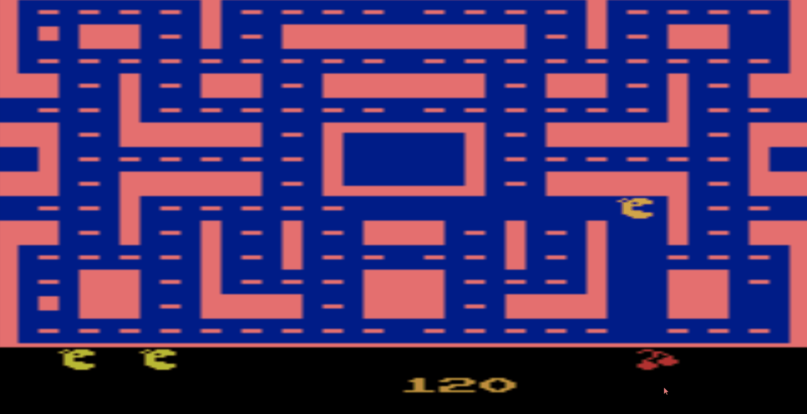

# rl-pac-man

Repository that lets you run and train an rl-model for playing pac-man. The code is a modified version of and inspired by Andrej Karpathy's excellent blog post Deep Reinforcement Learning: Pong from Pixels (http://karpathy.github.io/2016/05/31/rl/)

The model takes a policy gradient approach where the policy consists of a relatively simple neural network with one hidden layer and 200 neurons. The model is progressively updated using a RMSProp optimizer in order to maximise expected rewards. 

**Repository files**

model_training: trains model 

model_running: runs model

helper_function: contains primarily the policy function, the back propagation functions, the reward discounter, and the observation preprocesser

pacman.pickle: Model weights stored as a python dictionary (given that the model was only trained for a few hours on an old laptop it is not perfect)

